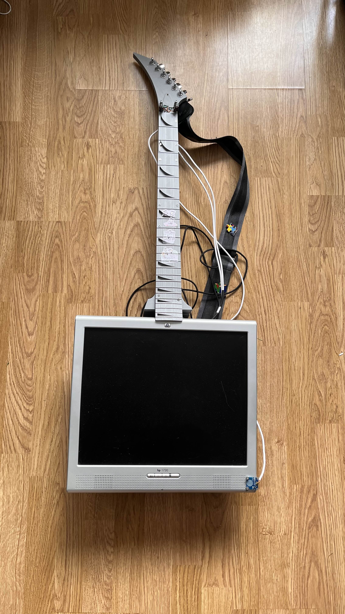
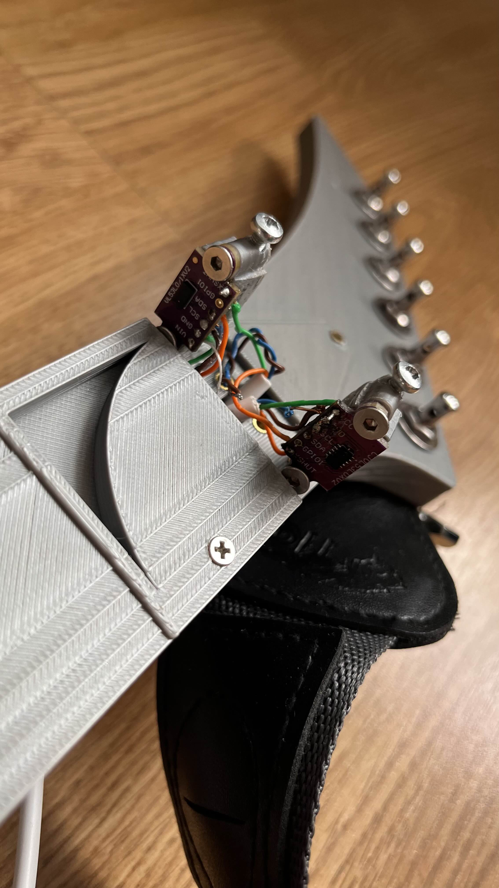
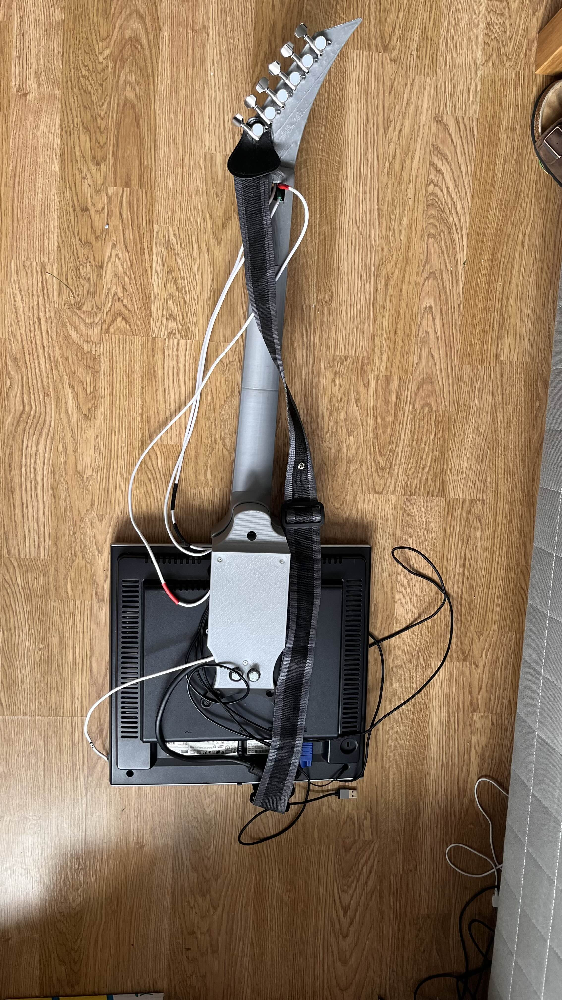

# ScreenSynth

An LCD guitar synthesizer based on the popular CRTelecaster design of the band ElectronicosFanasticos. 
 
There are a few differences in the models:
1. Using an LCD instead of a CRT.
2. Sound and visual systems are independant.
3. Guitar "strings" are ToF sensors instead of soft potentiometers.

## LCD

The LCD is driven by a Raspberry Pi Pico using a very ingenuitive [driver by HughMaingauche](https://github.com/HughMaingauche/PICO-VGA-Micropython).

